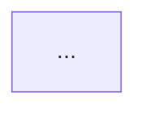

<what-to-do>

コードベースのアーキテクチャ上の摩擦を浮き彫りにし、**deepening の機会**（shallow なモジュールを deep に変えるリファクタリング）を提案する。テスタビリティと AI ナビゲビリティの向上が目的なのだ。

出力はすべて**日本語**で書く。英語術語（module・interface・seam・adapter・depth・leverage・locality）は日本語文中にそのまま混在させる。

</what-to-do>

<supporting-info>

## 用語集

以下の用語を必ず使用し、代替表現には置き換えない。

| 使う | 使わない |
|---|---|
| module | component, service, unit |
| interface | API, signature |
| seam | boundary |
| adapter | layer, wrapper |
| depth / deep / shallow | （代替なし） |
| leverage | （代替なし） |
| locality | （代替なし） |

核心原則：「削除して complexity が消えるなら pass-through だった。N 個の呼び出し元に complexity が再分散されるなら、そのモジュールは価値を生んでいた」

## プロセス

### ステップ 0 — 前提条件の確認

リポジトリルートの `CONTEXT.md` と `docs/adr/` を探す。`CONTEXT-MAP.md` がある場合はコンテキストごとのパスを参照する。

- **見つかった場合** → ドメイン語彙と設計決定を把握してから探索に進む。
- **見つからない場合** → まず `grill-with-docs` を起動する。ユーザーに伝える：

  > CONTEXT.md が見つかりませんでした。先に `grill-with-docs` でドメイン語彙を整備します。

  `grill-with-docs` 完了後にこのスキルの続きを再開する。

### ステップ 1 — 探索

Agent ツール（`subagent_type=Explore`）でコードベースを有機的に歩く。以下を探す：

- interface が implementation とほぼ同じ規模の module（shallow）
- 呼び出し元の境界を越えて漏れている complexity
- 一緒に変わるのに別々に存在している密結合なクラスター
- deep module がないために複製されているロジック

摩擦点をメモする。この時点では解決策を提案しない。

### ステップ 2 — Markdown レポートの提示

会話内に **3〜5件の deepening 候補** を Markdown レポートとして出力する。各候補は後述の[候補カードフォーマット](#候補カードフォーマット)に従う。

最後に**トップ推奨**セクションを付ける：1候補、理由1文のみ。

この時点では interface の設計は提案しない。

### ステップ 3 — グリリングループ

ユーザーが候補を選んだら：

1. 後述の[依存カテゴリ](#依存カテゴリ)で依存関係を分類する。
2. そのカテゴリに合った deepening 戦略を提示する。
3. ユーザーが複数のインターフェース設計案を比較したい場合、`architecture-review-interface` スキルを呼び出す。
4. `CONTEXT.md` の更新や ADR の提案は行わない — `grill-with-docs` に委ねる。
5. コードは書かない — 戦略の提示で止める。

---

## 候補カードフォーマット

````markdown
### [N]. [候補名 — 何を deepening するかを短く示す]

**推奨度:** `Strong` | `検討の余地あり` | `投機的`
**依存カテゴリ:** `in-process` | `local-substitutable` | `remote (owned)` | `external (mock)`

**対象ファイル:**
- `path/to/file`

**問題:** [1文。何が shallow か、どの complexity が漏れているか]

**解決策:** [1文。何を deepening するか]

**メリット:**
- leverage: ...
- locality: ...

#### Before



#### After


````

図のルール：
- ノードは10個以下。完全性より可読性を優先する。
- `classDef` で leakage エッジを赤、deep module を暗色にする。
- Before と After は同じスコープを示すこと。変化が一目でわかるように。

## 依存カテゴリ

候補を選んだ後、依存関係を以下のカテゴリで分類して戦略を決める。

| カテゴリ | 例 | 戦略 |
|---|---|---|
| **In-process** | 純粋計算・in-memory state | モジュールをマージしてインターフェース越しに直接テスト。adapter 不要 |
| **Local-substitutable** | PostgreSQL → PGLite、in-memory filesystem | テスト用スタンドインで seam を隠蔽。外部インターフェースに port を露出しない |
| **Remote (owned)** | 自社マイクロサービス・内部 API | seam に port（interface）を定義。ロジックを deep module に集約。HTTP adapter（本番）と in-memory adapter（テスト）を注入 |
| **External (mock)** | Stripe・Twilio 等の外部サービス | deep module が外部依存を注入された port として受け取る。テストは mock adapter を使用 |

**Seam の原則：**
- 1つの adapter = 仮想的な seam。2つの adapter = 本物の seam。本番 + テストの最低2つの adapter がなければ port を導入しない。
- モジュールの外部インターフェースに内部 seam を露出しない。

**テストの原則：**
- deepened module の interface でテストを書く — interface がテスト面になる。
- interface レベルのテストができたら、元の shallow module のユニットテストは廃棄する。
- テストは実装ではなく振る舞いを記述する。内部リファクタリングで壊れてはいけない。

</supporting-info>
