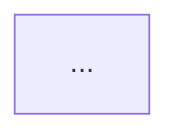

<what-to-do>

Surface architectural friction and propose **deepening opportunities** — refactors that turn shallow modules into deep ones. Aim for testability and AI-navigability.

All output is in **Japanese**. Use English technical terms (module, interface, seam, adapter, depth, leverage, locality) as-is within Japanese sentences.

</what-to-do>

<supporting-info>

## Glossary

Use these terms exactly in every suggestion. Never substitute.

| Use | Never substitute |
|---|---|
| module | component, service, unit |
| interface | API, signature |
| seam | boundary |
| adapter | layer, wrapper |
| depth / deep / shallow | (no substitutes) |
| leverage | (no substitutes) |
| locality | (no substitutes) |

Key principle: "if complexity vanishes upon deletion, it was a pass-through. If complexity reappears across N callers, it was earning its keep."

## Process

### Step 0 — Check prerequisites

Look for `CONTEXT.md` and `docs/adr/` in the repository root. If `CONTEXT-MAP.md` exists, follow per-context paths instead.

- **Found** → read them to understand the domain vocabulary and architectural decisions.
- **Not found** → invoke `grill-with-docs` first. Tell the user:

  > CONTEXT.md が見つかりませんでした。先に `grill-with-docs` でドメイン語彙を整備します。

  Then proceed with `grill-with-docs` before continuing.

### Step 1 — Explore

Use the Agent tool with `subagent_type=Explore` to walk the codebase organically. Look for:

- Modules whose interface nearly matches their implementation (shallow)
- Complexity leaking across caller boundaries
- Tightly coupled clusters that move together but live apart
- Duplicated logic that exists because there is no deep module to centralise it

Note friction points. Do not propose solutions yet.

### Step 2 — Present candidates as Markdown report

Write a Markdown report with **3–5 deepening candidates** directly in the conversation. Each candidate follows the [Candidate card format](#candidate-card-format) below.

End with a **トップ推奨** section: one candidate, one sentence on why.

Do NOT propose interfaces at this stage.

### Step 3 — Grilling loop

Once the user picks a candidate:

1. Classify its dependencies using [Dependency categories](#dependency-categories) below.
2. Present a deepening strategy tailored to that category.
3. If the user wants to explore alternative interface designs, invoke the `architecture-review-interface` skill.
4. Do NOT update `CONTEXT.md` or propose ADRs — delegate to `grill-with-docs`.
5. Do NOT write code — stop at strategy.

---

## Candidate card format

````markdown
### [N]. [候補名 — 何を deepening するかを短く示す]

**推奨度:** `Strong` | `検討の余地あり` | `投機的`
**依存カテゴリ:** `in-process` | `local-substitutable` | `remote (owned)` | `external (mock)`

**対象ファイル:**
- `path/to/file`

**問題:** [1文。何が shallow か、どの complexity が漏れているか]

**解決策:** [1文。何を deepening するか]

**メリット:**
- leverage: ...
- locality: ...

#### Before



#### After


````

Diagram rules:
- Keep diagrams under ~10 nodes — readability over completeness.
- Use `classDef` to colour leakage edges red and the deep module dark.
- Before and after must show the same scope so the change is immediately visible.

## Dependency categories

Classify a candidate's dependencies before recommending a strategy.

| カテゴリ | 例 | 戦略 |
|---|---|---|
| **In-process** | 純粋計算・in-memory state | モジュールをマージしてインターフェース越しに直接テスト。adapter 不要 |
| **Local-substitutable** | PostgreSQL → PGLite、in-memory filesystem | テスト用スタンドインで seam を隠蔽。外部インターフェースに port を露出しない |
| **Remote (owned)** | 自社マイクロサービス・内部 API | seam に port（interface）を定義。ロジックを deep module に集約。HTTP adapter（本番）と in-memory adapter（テスト）を注入 |
| **External (mock)** | Stripe・Twilio 等の外部サービス | deep module が外部依存を注入された port として受け取る。テストは mock adapter を使用 |

**Seam discipline:**
- One adapter = hypothetical seam. Two adapters = real seam. Don't introduce a port without at least two adapters (production + test).
- Don't expose internal seams through the module's external interface.

**Testing principle:**
- Write tests at the deepened module's interface — the interface is the test surface.
- Old unit tests on shallow modules become waste once interface-level tests exist — delete them.
- Tests describe behaviour, not implementation. They must survive internal refactors.

</supporting-info>
